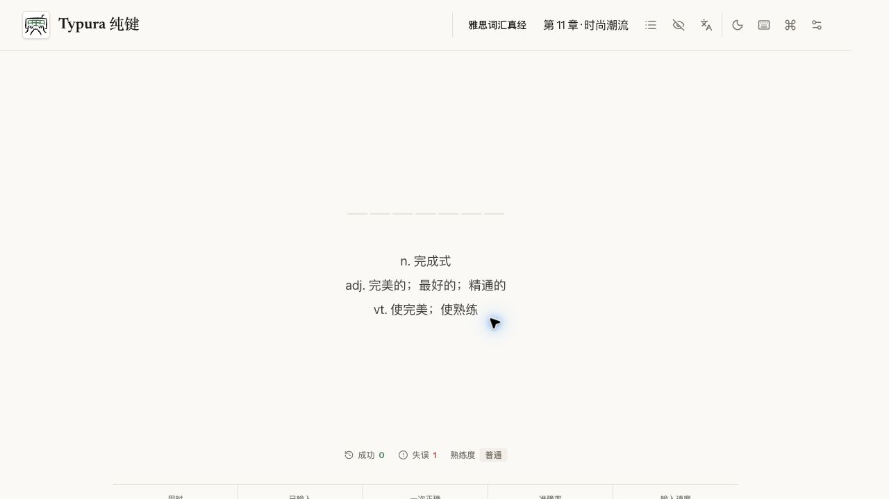
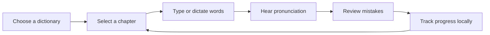

<div align="center">

# Typura

**A browser-based typing, dictation, and vocabulary practice desk built for focused repetition.**

[Open Typura](https://typura.yiheng.run) · [Report an issue](https://github.com/guoyiheng/typura/issues)


</div>

<p align="center">
  
</p>

## Overview

Typura brings typing practice, listening exercises, pronunciation, examples, and review data into one keyboard-friendly workspace. It includes a large built-in dictionary library and keeps learning progress on the current device by default.

### Features

- **Typing and dictation modes** with configurable prompts, pronunciation, and answer visibility.
- **Large dictionary library** covering English exams, school curricula, Japanese, Indonesian, programming terms, and more.
- **Chapter-based progress** with session time, accuracy, speed, and first-try success metrics.
- **Pronunciation and examples** with per-word audio and contextual sentences.
- **Mistake review** for revisiting difficult words and tracking mastery over time.
- **Keyboard-first controls** for fast practice without leaving the typing flow.
- **Local data ownership** through IndexedDB and Local Storage, including full export and restore.
- **Light and dark themes** designed for long practice sessions.

## Learning Workflow



## Quick Start

```bash
yarn install
yarn dev
```

The local application runs at `http://127.0.0.1:5173`.

Run the project checks:

```bash
yarn typecheck
yarn lint
yarn build
yarn worker:check
```

To test the Cloudflare Worker and static asset integration locally:

```bash
yarn worker:dev
```

## Project Structure

```text
typura/
├── src/
│   ├── components/    # Shared interface components
│   ├── hooks/         # Audio, speech, and interaction hooks
│   ├── pages/
│   │   ├── Practice/  # Typing and dictation workspace
│   │   └── Library/   # Dictionaries, chapters, and review data
│   ├── resources/     # Dictionary index and sound metadata
│   ├── store/         # Settings, progress, and practice state
│   └── utils/         # IndexedDB, import/export, and helpers
├── public/            # Dictionaries, audio, icons, and web assets
├── worker/            # Cloudflare Worker entry point
└── wrangler.toml      # Worker and static asset configuration
```

## Technology Stack

| Layer | Technology |
| --- | --- |
| Interface | React 19, TypeScript, Vite |
| State | Jotai, Immer |
| Local persistence | Dexie, IndexedDB, Local Storage |
| UI primitives | Radix UI, Headless UI, Floating UI |
| Audio and speech | Howler, browser speech APIs |
| Styling | Tailwind CSS 4 |
| Tables and export | TanStack Table, XLSX, dexie-export-import |
| Hosting | Cloudflare Workers and static assets |

## License

Licensed under the [MIT License](https://opensource.org/license/mit).

<p align="center">© 2026 yiheng</p>
